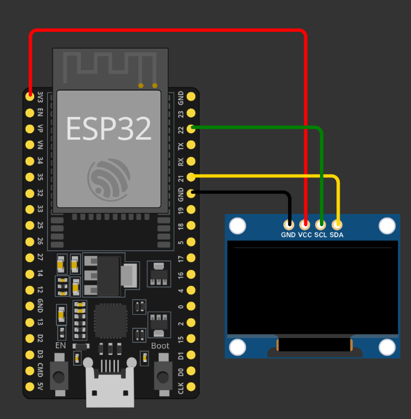

# Instrucciones

1. Conectar la primer placa ESP32 a la computadora y emitir el siguiente comando:

```bash
ls /dev | grep tty
```

En nuestro caso, la placa 1 esta en `ttyUSB0`. Repetir este paso para la
placa 2, y asi conseguir el nombre de nuestras placas. En nuestro caso, la
placa 2 esta en `ttyUSB1`.

2. Instalar las siguientes librerias

```bash
arduino-cli lib install "Adafruit GFX Library"
arduino-cli lib install "Adafruit SSD1306"
```

3. Ir a `address_finder/` y correr el comando:

```bash
arduino-cli compile
arduino-cli upload
```

Este te dara el address del display, el que vamos a estar utilizando seria
un [I2C OLED de 128x64](https://www.amazon.com.mx/dp/B09MSV1BYF?ref=ppx_yo2ov_dt_b_fed_asin_title).
En nuestro caso, el address fue `0x3C`

4. Conectamos el ESP-32 al display con las siguientes conexiones:

| ESP-32 | Display |
| ------ | ------- |
| 3.3V   | VCC     |
| GND    | GND     |
| SDA    | G21     |
| SCL    | G22     |



5. Una vez que tenemos el address del display y las conexiones al ESP-32,
   vamos a `display-ESP/` y ejecutamos:

```bash
arduino-cli compile
arduino-cli upload
```

6. Lo que deberiamos de ver en la pantalla seria el texto `It Works!`, asegurandonos
   que los pasos fueron ejecutados correctamente
