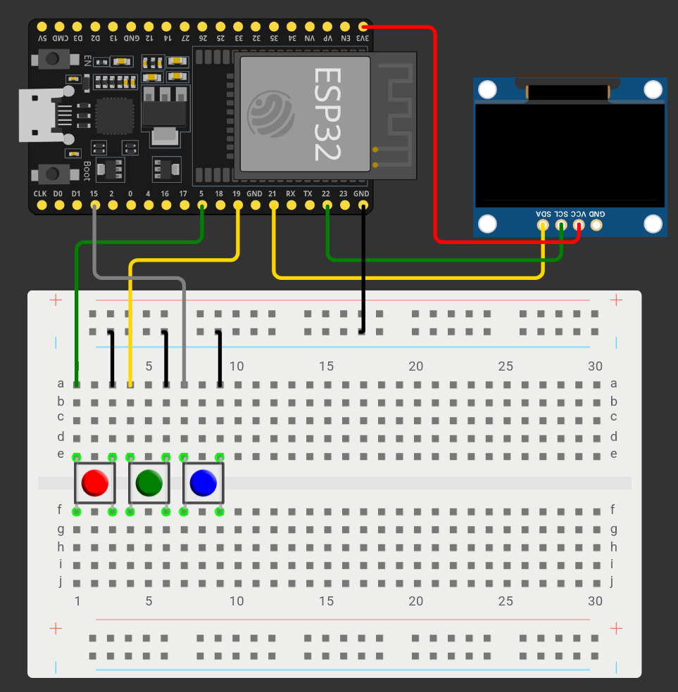

# Descripcion

Un sistema de comunicacion tipo "walkie-talkie" de texto entre varios ESP32
que funciona sin necesidad de router ni internet, con un alcance de hasta
200-400 metros.

# Diagrama esquematico



# Uso

- Boton rojo (boton 1): mueve el cursor hacia arriba
- Boton verde (boton 2): mueve el cursor hacia abajo
- Boton azul (boton 3): envia la opcion del menu

# Requerimientos

Este proyecto es funcional en linux (Debian 13)

## Materiales

- 2 x ESP-32 (de 38 pines) (utilizados en el desarrollo: [UNIT ELECTRONICS ESP32 38 Pines ESP WROOM 32](https://www.amazon.com.mx/dp/B08V517B56?ref=ppx_yo2ov_dt_b_fed_asin_title) )
- 2 x I2C OLED displays (utilizados en el desarrollo: [UNIT ELECTRONICS Display OLED Blanco 128x64 0.96 I2C SSD1306](https://www.amazon.com.mx/dp/B09MSV1BYF?ref=ppx_yo2ov_dt_b_fed_asin_title) )
- ? x Protoboards
- ? x Push-buttons
- Cables jumper

## Arduino en la linea de comandos

1. Instalar arduino junto con arduino-cli

```bash
sudo apt-get install arduino arduino-cli
```

2. Instalar el `core` de esp32

```bash
arduino-cli core install esp32:esp32
```

Recuerda cambiar el puerto donde este conectado el ESP-32 (puede ser `ttyACM0`).
Esto se puede verificar con `ls /dev | grep tty`, en nuestro caso resulto
estar en `/dev/ttyUSB0`, asi que eso es lo que pondremos en el archivo de
`sketch.yaml`

```yaml
default_fqbn: esp32:esp32:esp32
default_port: /dev/ttyUSB0
```

3. Instalar las librerias

```bash
arduino-cli lib install "WiFi"
arduino-cli lib install "Adafruit GFX Library"
arduino-cli lib install "Adafruit SSD1306"
```

4. Anotar los MAC addresses (ver 01-get-MAC), en nuestro caso, fueron:

- Placa 1: 88:57:21:79:C1:3C
- Placa 2: 88:57:21:79:81:04
