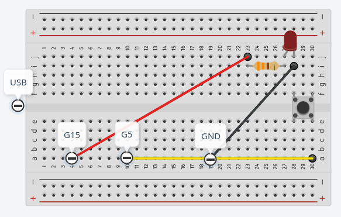

# Instrucciones

1. Conectar la primer placa ESP32 a la computadora y emitir el siguiente comando:

```bash
ls /dev | grep tty
```

En nuestro caso, la placa 1 esta en `ttyUSB0`. Repetir este paso para la
placa 2, y asi conseguir el nombre de nuestras placas. En nuestro caso, la
placa 2 esta en `ttyUSB1`.

2. Conectar cada ESP32 de la siguiente manera



3. Ejecutar el siguiente comando desde `esp-now-multi/`:

```bash
arduino-cli compile
```

4. Subir los cambios a cada ESP32 utilizando:

```bash
arduino-cli upload
```

> [Nota]
> Se tendra que modificar `sketch.yaml` en la segunda linea dependiendo de
> en que puerto esten los ESP32

# Utilizacion

Si se presiona el boton en cualquier ESP32, se vera como cambia el LED de
encendido a apagado y viceversa.

## Demo

 
